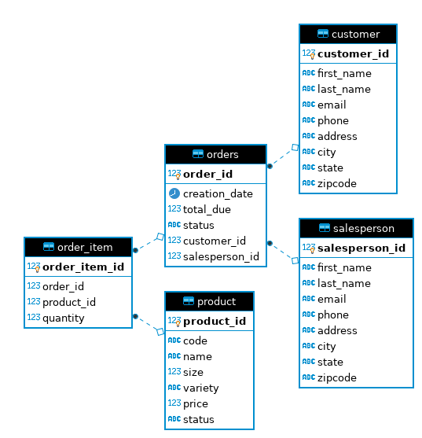

# JDBC

## Introduction
The following project helps new developers in getting familiarized with the 
concepts of **Java Database Connectivity** (JDBC). JDBC allows a connection between
a Java application and a RDBMS. Throughout the project, the developer has learned
the use of JDBC drivers, data access design patterns and more.

## ER Diagram

    

 
## Design Patterns
Data Access Object Design Pattern is used to separate the data persistence logic in a separate layer. 
This way, the service remains completely in dark about how the low-level operations to access the database is done.
In general, an object could be one row in the database table. 
A Repo pattern focuses only one single table access per class and acts like a collection.
In short the DAO pattern is an abstraction of data persistence, while the Repo pattern
is an abstraction of a collection of objects. 
