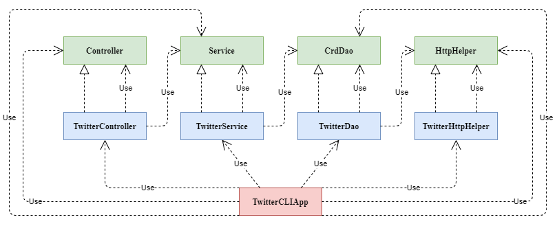

# Twitter App

## Introduction
The Twitter App allows the user to call several functions of the Twitter API
within a simple Java application. The program has three main features: "post", "show" and "delete".
Based on simple CRUD operations, these tasks are performed by several sub-modules based on the MVC design pattern. 
The dependencies are handles via the Spring Framework for easy accessibility.

Through the development of the application, the developer has learned the fundamentals of REST API, HTTP Connection
and JSON file configuration, as well as the outline of MVC design pattern and Spring Framework. The program's 
testing were via Integration and Unit testing, with the unit test being implemented
with Mockito.

## Quick Start
The pom.xml file required for the project's configuration is included in the folder.
To build the project package using Maven, use the following command:
```
mvn package
```
Commands like `validate`, `compile`, `test` and many more can be used to run the application
through the Maven default lifecycle.

Before executing the program, proper environment variables must be set. These are authentication
tokens required for connection with Twitter's REST API. Once a Twitter Dev account has been set up,
and you have access to the four parameters: `consumerKey`, `consumerSecret`, `accessToken`, `tokenSecret`,
setup the environment variables with a command terminal using:
```bash
export consumerKey={#keyValue}
export consumerSecret={#secretValue}
export accessToken={#accessValue}
export tokenSecret={#tokenValue};
```

To run the application via Maven, find the .jar file in the /target directory that should have been instantiated 
when the project is built. Run the application by executing the following command:
```
java -jar #jarFileName.jar post|show|delete [options]
```
* `post` command should be passed using the following format: `post "#textBody" Latitude:Longitude`
* `show` command should be passed using the following format: `show "#idStr" "displayFields"`
  * `idStr` is the id of the Tweet you are searching for, written in String format
  * `displayFields` are the fields you wish to view from the output Json text, separated by a comma.
* `delete` command should be passed using the following format: `delete "listOfIds"`
  * `listOfIds` indicate a list of ids, separated by a comma, of Tweets you wish to delete 
  
**Argument Constraints**
* `textBody` should not exceed 280 characters
* `longitude` should be in the range of -180 to 180
* `latitude` should be in the range of -90 t0 90
* `idStr` should not exceed 19 digits

## Design
### UML Diagram
<p align="center">
    
</p>

### Components
#### App/Main
The application/main component binds everything together and executes the program. The arguments
are parsed and the controller layer is called. 
#### Controller
The controller component interacts with the user input and stores them in separate variables. Then, it 
calls the service layer and returns the results
#### Service
The service component handles the business logic of the program, placing restrictions on user inputs and
catching exceptions. The component calls the Dao layer to interact with the Twitter REST API.
#### Dao
The data access component handles models and makes requests to the Twitter REST API.
The component calls HttpHelper to parse the response from the API.
#### HttpHelper
The HttpHelper component authorizes the connection with OAuth consumer and signs them, establishing the connection with
the API.

## Spring
The projects dependencies are handled with the implementation of Spring Framework. Specifically,
the Component Scanning approach is used within the framework. In this methodology,
the dependencies are injected in constructors when interfaces are implemented by annotating them
with `@Autowired`. Furthermore, each dependent class are annotated with `@Component`, `@Service`, `@Repository`,
and `@Controller` to denote certain situations. The framework is tied through a configuration file which
sets up the IoC container.

## Models
The models of the project are implemented as Plain Old Java Objects. The Tweet model included in the
project is a highly simplified version of the actual Tweet model from Twitter. Below is the outline of
fields included in the simplified Tweet object:
```
created_at
id
id_Str
text
entities
    hashtag
    user_mentions
coordinates
    type
    coordinates [longitude,latitude]
retweet_count
favorite_count
favorited
retweeted
```

## Improvements
1. Expand the tweet model to include more fields
2. Support more refined search option - i.e. Search by user, text, etc.
3. Integration to automatically obtain the system's geo location