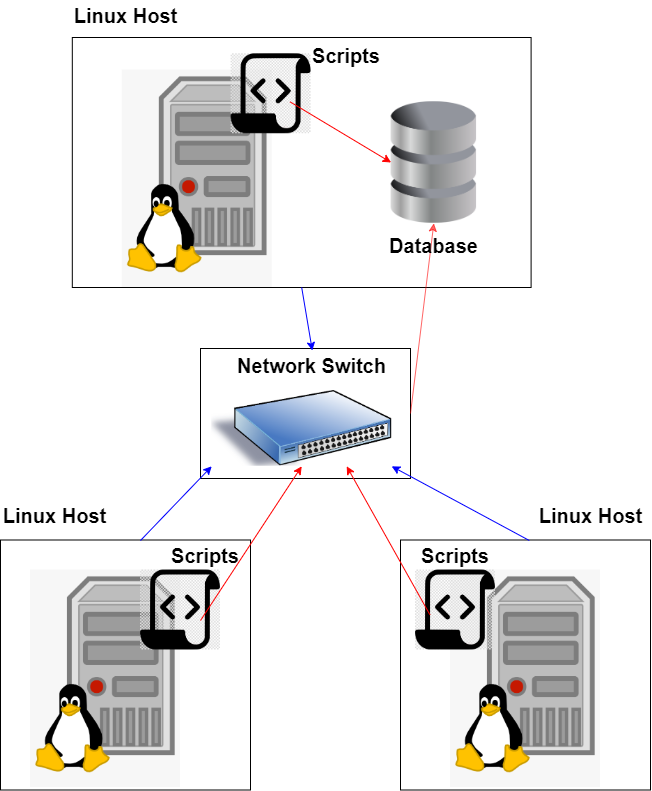

# Linux Cluster Monitoring Agent

## Introduction
The Linux Cluster Monitoring Agent records the hardware specifications of each host machine and monitors their memory usage in real time. The machines are connected under a common network via a network swtich. The data is then stored in a RDBMS database for easy accessibility and maintenance. This in turn allows any team that administrates Linux Clusters to generate reports for future resource planning and tight optimization. The program was implemented using both bash scripts and the PostgreSQL database, while also containing some SQL queries in order to answer possible questions. Utilizing Docker, the end product is lightweight, versatile and easy to use.

## Architecture and Design
<p align="center">
   
</p>
As noted above in the introduction, the bash scripts are run on separate linux machines, all connected with a network switch. The host's information is then sent to the relational database which is parsed by the end user. In the case of the picture, a host is also acting as the server receiving all incoming data. As more machines are added into the cluster, it is safer to prepare a separate server to secure the traffic.

### Tables Explanation
Within the database `host_agent`, there are two tables: `host_info` and `host_usage`. `host_info` stores the hardware specification of the host machine and inserts it into the database. It contains information like CPU Architecture, CPU Model and more. The latter table, `host_usage` stores the resource usage data of the host machine. It collects information like the amount of free memory and available disk space.

#### `host_info` Contents:
* `id`: Host identification number unique to each host
* `hostname`: Name of the host connected to the database
* `cpu_number`: Number of CPUs in the host machine
* `cpu_architecture`: System architecture of the host machine
* `cpu_model`: Model of the host machine's CPU
* `cpu_mhz`: CPU processor of the host machine
* `L2_caches`: Size of the L2 cache which holds data that is likely to be accessed by the CPU next
* `total_mem`: Total memory within the host machine
* `timestamp`: Time at which the data was collected, referred to in UTC timezone

#### `host_usage` Contents:
* `timestamp`: Same as the column in `host_info`, returns the time at which the data was collected
* `host_id`: Host identification number, follows the `id` column within `host_info`
* `memory_free`: Amount of free memory within the host machine
* `cpu_idle`: Percentage of CPU time of which it was idle
* `cpu_kernel`: Percentage of CPU time of which it was running kernel code
* `disk_io`: Number of disk I/O
* `disk_available`: Amount of disk space available in root directory

### Scripts Explanation
* [`host_info.sh`](scripts/host_info.sh) is run on every cluster within the network connection to gather the hardware specification of each machine. It is executed only once with the assumption that the host machine's specifications do not change.
* [`host_usage.sh`](scripts/host_usage.sh) is run on every cluster within the network connection to gather the resource usage of each machine. It is executed every minute and stores consecutive data into the database.
* [`psql_docker.sh`](scripts/psql_docker.sh) is run to create, start and stop the PostgreSQL instance using docker. Note that the script does not support deletion of docker containers or volumes.
* [`ddl.sql`](sql/ddl.sql) is a SQL script to create the two tables mentioned above: `host_info` and `host_usage`. If the tables already exist, the script will exit with an error.
* [`queries.sql`](sql/queries.sql) contains two SQL queries to assist in database management and information processing. The first query groups hosts by the number of CPUs in their machine and sorts their memory size in descending order. The second query averages the amount of used memory (in percentage) over 5 minute intervals for each host.

## Script Usage

**1. Initializing the PostgreSQL instance**
 
 To start off, we have to initialize the PostgreSQL container with docker, andstart the container.

```bash
# Create PSQL docker container from the machines home directory
./linux_sql/scripts/psql_docker.sh create psql_user psql_ password

# Start the container
./linux_sql/scripts/psql_docker.sh start psql_user psql_password
```

**2. Create the database `host_agent` and create two tables `host_info` and `host_usage`**
 
 We first need to connect to PSQL instance, then create the database using SQL commands. Then, we can run the aforementioned script to create the tables.

```bash
# Connect to PSQL
psql -h psql_host -U psql_user -W
```
```SQL
# Create the database
CREATE DATABASE host_agent;
```
```bash
# Create the tables
psql -h psql_host -U psql_user -d db_name -f ./linux_sql/sql/ddl.sql
```

**3. Run `host_info.sh`**

 As previously mentioned, the script stores the host's system specification into the `host_info` table.

```bash
# Stores host machine specs into PSQL database
./linux_sql/scripts/host_info.sh psql_host psql_port db_name psql_user psql_password
```

**4. Run `host_usage.sh`**

 The script stores the host's current resource usage into the `host_usage` table.

```bash
# Stores host machine resource usage into PSQL database
./linux_sql/scripts/host_usage.sh psql_host psql_port db_name psql_user psql_password
```

**5. Setup crontab**

 crontab automates the execution of `host_usage.sh` so that the information is collected every minute. 

```bash
# Edit crontab jobs
crontab -e

# Enter the following line into the opened file
* * * * * bash [path]/host_usage.sh psql_host psql_port db_name psql_user psql_password &> /tmp/host_usage.log

# List current crontab jobs
crontab -ls

# Verify by opening performance log
cat /tmp/host_usage.log
```
## Possible Improvements
1. In order to facilitate the automation of `host_usage.sh` a PGPASS file had to be created in order bypass the password check. Further research in networking and encryption will allow the developer to control the encryption in each connected clusters and allow easier accessibility to each host machine.

2. Currently, the `host_info.sh` script runs only once at the start under the assumption that the host's hardware specs do not change. In order to accomodate for possible system upgrades, we can run the script in long intervals and compare the result with the previously stored data, overwritting when necessary.

3. A final suggestion for improvement would be to try and automate the entire process, without the need of CML interaction (only when prompted with parameters). For intance, perhaps a separate bash script can be created in which all the separate bash scripts are run. The "enveloped" bash script will acquire all user parameters required to run each script (i.e. `psql_host`, `psql_port`, etc.) and execute them in order.

