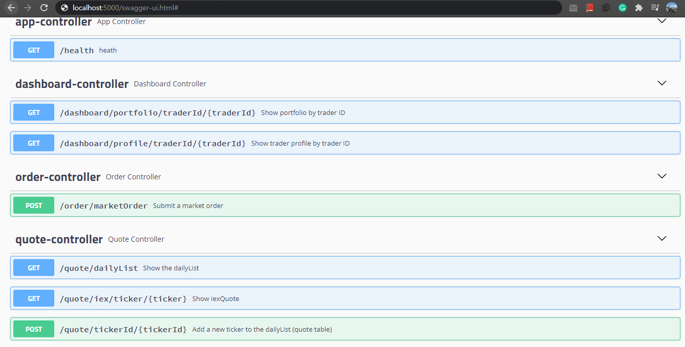
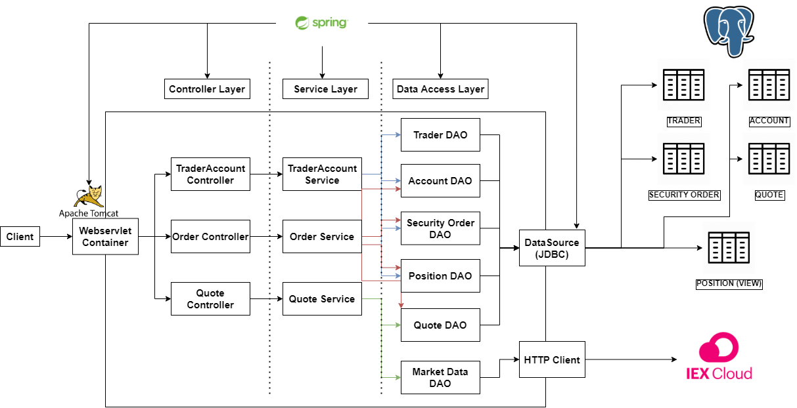
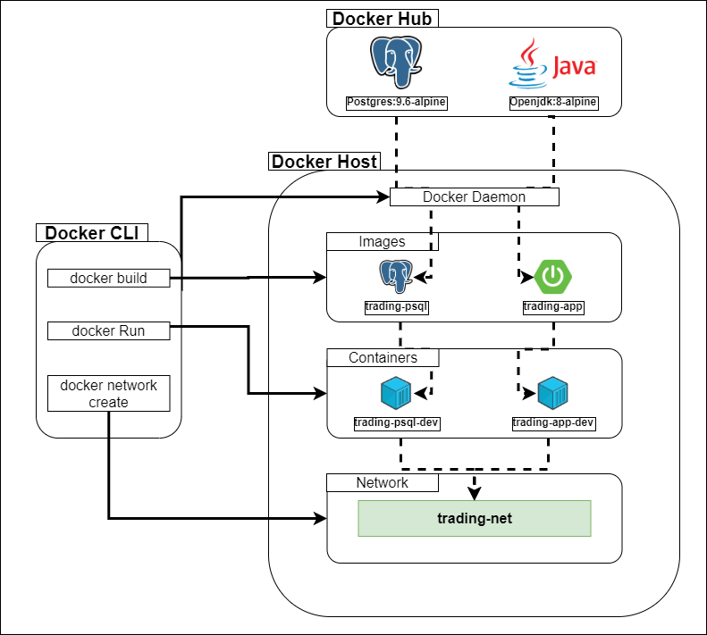

Table of contents
* [Introduction](#Introduction)
* [Quick Start](#Quick\Start)
* [Architecture](#Architecture)
* [REST API USAGE](#REST\API\USAGE)
* [Docker Deployment](#Docker\Deployment)
* [Improvements](#Improvements)

# Introduction
The SpringBoot project is a microservice application that simulates an online trading platform. It implements
all functionalities of a typical trading platform such as transactions between traders, processing buy/sell orders and updating existing quotes.
The API is designed to be used by front-end, mobile developers and stock traders.
Using IEX Cloud as the data source, the RESTful API is implemented using Java 8 and SpringBoot framework. Moreover,
The application pulls real-time stock market data and stores it to a RDBMS using PSQL for easy access.

# Quick Start
**Pre-requisites**: Docker (Version 17.05 or higher), CentOS 7, PSQL, Java 8

1. Build the `trading_psql` docker image which initializes all database and tables.
   ```bash
   cd ./springboot/psql
   docker build -t trading-psql .
   docker image ls -f reference=trading-psql
   
   //Create and run the container
   docker run --name trading-psql -d -p 5432:5432 trading-psql
   docker start trading-psql
     
   //Test if the tables are correctly created by connecting to PSQL instance
   psql -h localhost -p 5432 -U postgres
   
   //Stop the container
   docker stop trading-psql
   ```
   
2. Build the `trading-app` which is a docker image that compiles and packages the source code using Maven, and runs the Java application.
    ```bash
    cd ./springboot/
    docker build -t trading-app . 
    docker image ls -f reference=trading-app
    ```  
   
3. Create the docker network using the cmd:
   ```bash
   docker network create --driver bridge trading-net
   ```  
4. Start `psql-trading` container, attaching it to the docker network
   ```bash
   docker run --name trading-psql-dev \
   -e POSTGRES_PASSWORD=password \
   -e POSTGRES_DB=jrvstrading \
   -e POSTGRES_USER=postgres \
   --network trading-net \
   -d -p 5432:5432 trading-psql
   ```
5. Start `trading-app` container, attaching it to the docker network
   1. Set up IEX Token as an environmental variable
   
      ```bash
      IEX_PUB_TOKEN="your_token"
      ```
      
   2. Start the container
      ```bash
      docker run --name trading-app-dev \
      -e "PSQL_URL=jdbc:postgresql://trading-psql-dev:5432/jrvstrading" \
      -e "PSQL_USER=postgres" \
      -e "PSQL_PASSWORD=password" \
      -e "IEX_PUB_TOKEN=${IEX_PUB_TOKEN}" \
      --network trading-net \
      -p 5000:5000 -t trading-app
      ```
6. Test the application using SwaggerUI with the URI: `http://localhost:5000/swagger-ui.html#/`
   <p align="center">
      
   </p>

# Architecture
<p align="center">
    
</p>

### Controller Layer
The controller layer of the application handles the user input, and their HTTP requests.
The HTTP requests are handled by Apache Tomcat which allows it to be run in the JVM.
The service layer is then called to return the results.

### Service Layer
The service layer handles the business logic of the application. Most transactions like buy and sell orders are processed in the service layer.
Moreover, it catches irregularities in user inputs and throws appropriate exceptions for debugging. 

### DAO Layer
The data access object layer persists and retrieves data from the external database sources. In our case, 
real-time stock market data is obtained from the IEX Cloud API, and is then stored into a PSQL database for easy access.

### SpringBoot
The project is implemented with the SpringBoot framework, an extension of the Spring framework allowing for easier configuration of Spring application.
The application uses the default Apache Tomcat included within the framework to host a WebServlet providing a 'pure java' web server environment in which
Java code can run. The framework also handles the project dependencies using component scanning. This in turn uses a separate configuration file which sets
up the Inversion of Control (IOC) container.

### PSQL & IEX
IEX Cloud is the REST API where we receive the real-time stock market data from.
The Java application itself does not store any data. Instead, we choose to employ PSQL as our RDBMS to store the application data in a database instance.
Since the application and the data storage are decoupled if an application instance crashed, the historical data will not be lost.


# REST API Usage
## Swagger
Swagger is an open-source software framework backed by a large ecosystem of tools that helps developers design, build, document, and consume RESTful web services. The purpose of using
Swagger is because it provides an accessible GUI for testing our API. Swagger will be beneficial to those developing and consuming REST APIs.

## Quote Controller
- The Quote Controller receives stock market data from IEX cloud and saves them as POJOs defined in `models`. Using Quote DAO, the quote data is retrieved and updated
in the PSQL database which can be manipulated further.
- End Points: 
  - GET `/quote/ticker/{ticker}`: Show the iexQuote for a given symbol/ticker
  - GET `/quote/dailyList`: Show the daily list (Quote table) which contain all tickers that are available for trade on the platform
  - PUT `/quote/iexMarketData`: Update the quote table using Iex data
  - PUT `/quote/`: Update a given quote in the quote table
  - POST `/quote/tickerId/{tickerId}`: Add a new ticker to the quote table
  
## Trader Controller
- The Trader Controller handles the creation and deletion of a Trader on the platform and their associated accounts. It also allows traders
to deposit and withdraw funds from their accounts.
- End Points:
  - POST `/trader/firstname/{firstname}/lastname/{lastname}/dob/{dob}/country/{country}/email/{email}`: Creates a trader and their account
  - POST `/trader/`: Creates a trader and their account with DTO (i.e. TraderId and AccountId are auto generated by the database)
  - DELETE `/trader/traderId/{traderId}`: Deletes a trader only if the amount in their account is 0 and no positions are open
  - PUT `/trader/deposit/traderId/{traderId}/amount/{amount}`: Deposit the specified amount into the account
  - PUT `/trader/withdraw/traderId/{traderId}/amount/{amount}`: Withdraw the specified amount from the account

##Order Controller
- The Order Controller handles any market order that takes place on the platform. 
The two types of transactions available are buy and sell orders.
- End Point:
  - POST `/order/marketOrder`: Submits a market order
  
# Docker Deployment
### Docker Image
<p align="center">
    
</p>

- The **docker hub** is where official images reside which can be pulled and loaded into custom images. For the SpringBoot
application, the offical images of PSQL, Openjdk and Maven are pulled and built upon.

- The `trading-psql` image is built from the official PSQL docker image and is extended with a custom build Dockerfile.
The Dockerfile initiates the DDL files, and creates all the necessary databases and tables initializing them for consumption.
The docker image can be built using the following cmds:
  
- The `trading-app` image is built from the official Openjdk and Maven images.
When the image is built, the source code is first compiled and packaged using Maven and
executes the Java Application. 

- The **docker network** allows for allows docker containers to connect together in a platform-agnostic way.
By creating an independent docker network `trading-net`, the containers are able to communicate to each other within the bridge network.


# Improvements
1. Implement the optional Dashboard Controller
2. Increase code coverage to make the application more robust
3. Implement security measures within the application - Password protected, secure trasactions etc.
4. Implement user input interface to process transactions with simple input arguments
5. Implement and test multiple application instances and traffic limit